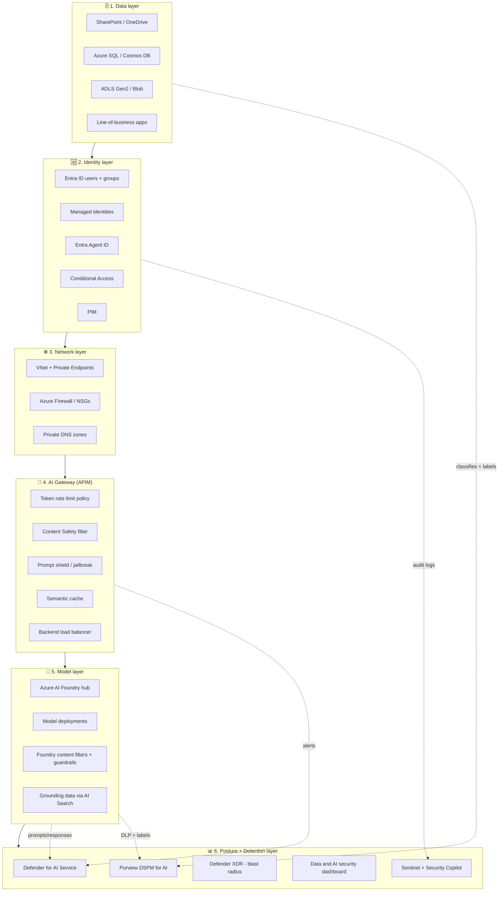
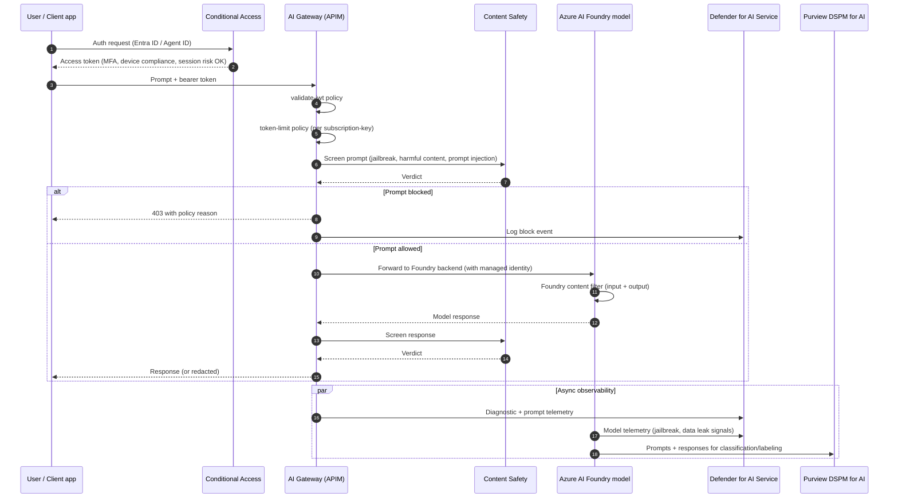
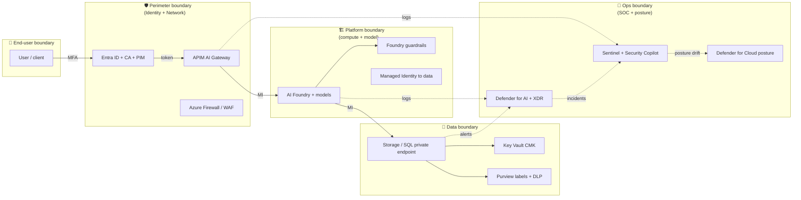

# AI Security Stack - Architecture Diagrams

Reference architecture for the SC-500 **Secure compute (AI)** skill area.
The stack flows: **Data → Identity → Network → Gateway → Model → Posture**.

Each layer maps to specific SC-500 exam skills - see the tables below each
diagram for the mapping.

---

## 1. Layered stack view

### Skill mapping

| Layer | SC-500 skill bullet | Where in this repo |
| --- | --- | --- |
| Data | "Implement data protection for AI" | `04-data-protection/`, `06-ai-workload-security/lab-02-purview-dspm-copilot.md` |
| Identity | "Configure Entra Agent ID with Conditional Access" | `06-ai-workload-security/lab-03-entra-agent-id.md` |
| Network | "Secure endpoints for AI workloads with Private Link" | `02-platform-protection/`, `04-data-protection/lab-02-storage-security.md` |
| Gateway | "Implement AI Gateway in APIM for Azure AI Foundry" | `06-ai-workload-security/lab-01-ai-gateway.md` |
| Model | "Implement guardrails in Azure AI Foundry" | `06-ai-workload-security/study-guide.md` |
| Posture | "Configure Defender for AI Service"; "Purview DSPM for AI" | `06-ai-workload-security/lab-04-defender-for-ai.md`, `lab-02-purview-dspm-copilot.md` |

---

## 2. Request-time sequence (user → model → posture)

Exam trap watch-list encoded in this flow:

- **Token issuance** happens at **Entra ID**, not at APIM. APIM only **validates** the JWT.
- **Content Safety** enforces at **two** places (APIM + Foundry). If a question asks where to block a jailbreak prompt **before** it reaches the model, the answer is **APIM AI Gateway with Content Safety policy**.
- **Defender for AI Service** is a **detection** control (alerts), not a **prevention** control.
- **Purview DSPM for AI** is about **data visibility and DLP for prompts**, not about blocking traffic.

---

## 3. Trust boundaries and control ownership

Ownership cheat-sheet:

| Boundary | Who owns it | Primary control |
| --- | --- | --- |
| End-user | User + IT | MFA, device compliance |
| Perimeter | Identity + Network team | Entra ID CA, APIM AI Gateway, WAF |
| Platform | AI/App team | Foundry guardrails, managed identity |
| Data | Data team + Compliance | CMK, private endpoints, Purview labels |
| Ops | SOC | Defender XDR, Sentinel, Security Copilot |

---

## How to use these diagrams while studying

- Print the **layered stack view** and keep it beside you during labs 01-04 in `06-ai-workload-security/`.
- Use the **sequence diagram** as your mental model when a question describes an "AI request flow" - trace it top to bottom to locate the control being asked about.
- Use the **trust boundary diagram** when a question is about **"who owns the control"** or **shared responsibility** for an AI workload.
